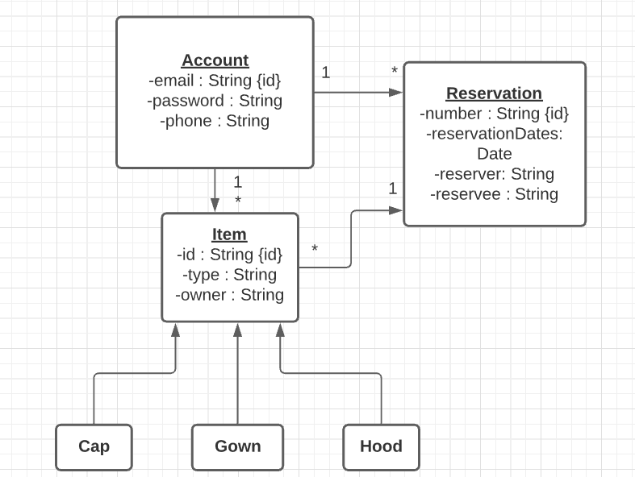

# Domain Model
## Image of the Domain

## Explanations of classes
* Account: This is a user of the software.  An account allows a user to both list items and make reservations.
* Item: This is the generic item that is listed by the account holder.  The three items that can be listed are: caps, gowns and hoods.
* Reservation: This represents the reservation referencing the items begin resreved by the reservee and the person who is giving the items.

## Explanation of relationships
* Account and Item: A user can place multiple items to be reserved by someone else.
* Item and Reservation: A reservation can hold multiple items are a time.
* Reservation and Account: A account can preform one reservation at a time, before the system has to create another reservation.