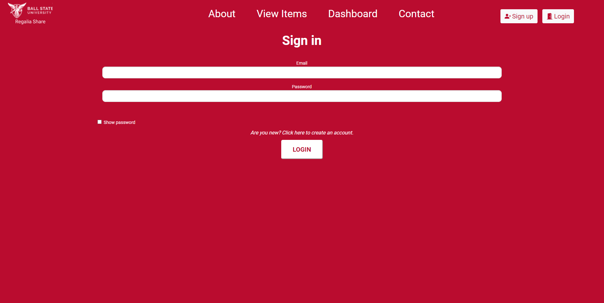

## Deploying the Regalia-Share Application  

### Prerequisites  
What needs to be installed before starting:  

#### Your local machine.  
1.  Navigate to https://github.com/ndd99/academic-regalia-loan-app/blob/master/Documentation/Development.md  
2.  Follow the documentation and replicate the development environment before trying to host.  
3.  Once you reach the following page, you are ready to move on.  
  *   
* This applcation will be hosted by Ball State through AWS.  
* In order to host it, an Elastic Beanstalk environment will be configuerd through AWS.  
  * Open the Elastic Beanstalk console using this preconfigured link: console.aws.amazon.com/elasticbeanstalk/home#/newApplication?applicationName=tutorials&environmentType=LoadBalanced  
  * For Platform, select the platform and platform branch that match the language used by your application.  


### Uploading To the Web Server  

* Create a source bundle containing the files created by Composer. The following command creates a source bundle named ```cake-default.zip.``` It excluded files in the vendor folder,
which take up a lot of space and are not necessary for deploying your application to Elastic Beanstalk.  
```  
eb-cake zip ../cake-default.zip -r * .[^.]* -x "vendor/*"  
```  
  * Upload the source bundle to Elastic Beanstalk to deploy CakePHP to your environment.  
* To Deploy a source bundle  
  * Open the Elastic Beanstalk console, and in the Regions list, select your AWS Region.  
  * In the navigation pane, choose Environments, and then choose the name of your environment from the list.  
  * On the environment overview page, choose Upload and deploy.  
  * Use the on-screen dialog box to upload the source bundle.  
  * Choose Deploy.
  * When the deployment completes, you can choose the site URL to open your website in a new tab.  
  * When the process completes, click the URL to open your CakePHP application in the browser  
  
### Add a database to your environment  

* Launch an Amazon RDS database instance in your Elastic Beanstalk environment. You can use MySQL, SQLServer, or PostgreSQL databases with CakePHP on Elastic Beanstalk. For this example, we'll use PostgreSQL.  
* To add an Amazon RDS DB instance to your Elastic Beanstalk environment.  
 * Open the Elastic Beanstalk console, and in the Regions list, select your AWS Region.  
 * In the navigation pane, choose Environments, and then choose the name of your environment from the list.  
 * In the navigation pane, choose Configuration.  
 * Under Database, choose Edit.  
 * For DB engine, choose postgres.
 * Type a master username and password. Elastic Beanstalk will provide these values to your application using environment properties.  
 * Choose Apply.

* CakePHP's database configuration is in a file named app.php in the config folder in your project code. Open this file and add some code that reads the environment variables from ```$_SERVER``` and assigns them to local variables. Insert the highlighted lines in the below example after the first line ```(<?php)```:  
 * ```Example ~/Eb-cake/config/app.php```   
  ```
   <?php
if (!defined('RDS_HOSTNAME')) {
  define('RDS_HOSTNAME', $_SERVER['RDS_HOSTNAME']);
  define('RDS_USERNAME', $_SERVER['RDS_USERNAME']);
  define('RDS_PASSWORD', $_SERVER['RDS_PASSWORD']);
  define('RDS_DB_NAME', $_SERVER['RDS_DB_NAME']);
}
return [
...
 ```
 * The database connection is configured further down in app.php. Find the following section and modify the default datasources configuration with the name of the driver that matches your database engine (Mysql, Sqlserver, or Postgres), and set the host, username, password and database variables to read the corresponding values from Elastic Beanstalk.   
### To update your Elastik Beanstalk environment:
 1. Create a new source bundle:
  ```
  ~/eb-cake$ zip ../cake-v2-rds.zip -r * .[^.]* -x "vendor/*"
  ```  
 2. Open the Elastic Beanstalk console, and in the Regions list, select your AWS Region.  
 3. In the navigation pane, choose Environments, and then choose the name of your environment from the list.  
 4. Choose Upload and Deploy.  
 5. Choose Browse and upload cake-v2-rds.zip.  
 6. Choose Deploy. 
 
### Starting and Stopping the Webserver:
  
Navigate to the XAMPP control panel and select start or stop for the Apache Webserver or MySQL.  

### How to Troubleshoot the application:  
* Navigate to where the application is located in ```C:\XAMPP\htdocs\regalia\regalia-loan-app-code``` and run  
 ```
 composer update
 ```  
### Where to find source of errors:  
* Navigate to ```C:\XAMPP\htdocs\regalia\regalia-loan-app-code\config\app.php```  
 * Define this logger:  
 ```
 use Cake\Log\Log;

// Short classname
Log::config('debug', [
    'className' => 'File',
    'path' => LOGS,
    'levels' => ['notice', 'info', 'debug'],
    'file' => 'debug',
]);

// Fully namespaced name.
Log::config('error', [
    'className' => 'Cake\Log\Engine\FileLog',
    'path' => LOGS,
    'levels' => ['warning', 'error', 'critical', 'alert', 'emergency'],
    'file' => 'error',
]);
```  
### Most Vulnerable Components:  
* A listing with lots of notes can break the view item page.
* Users are able to reserve their own listed items which should not happen and will be fixed in the next iteration.
* For the deployed site, there is not database connected so users cannot log in or sign up. This will be fixed soon.


