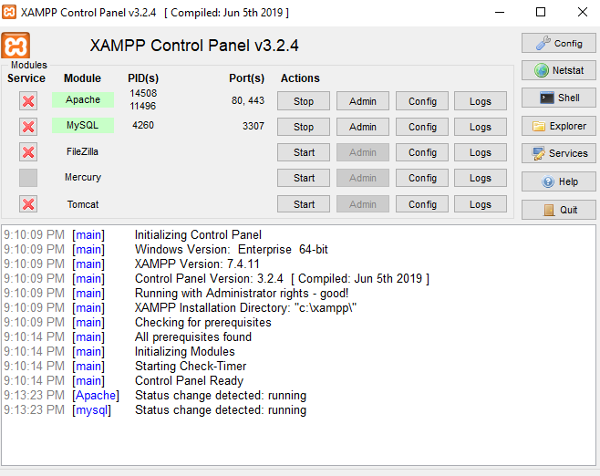
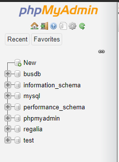
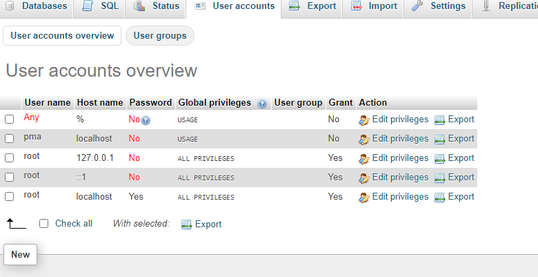
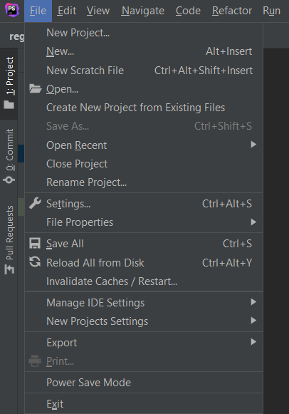
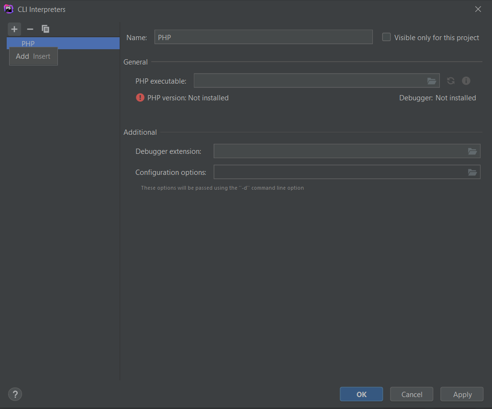
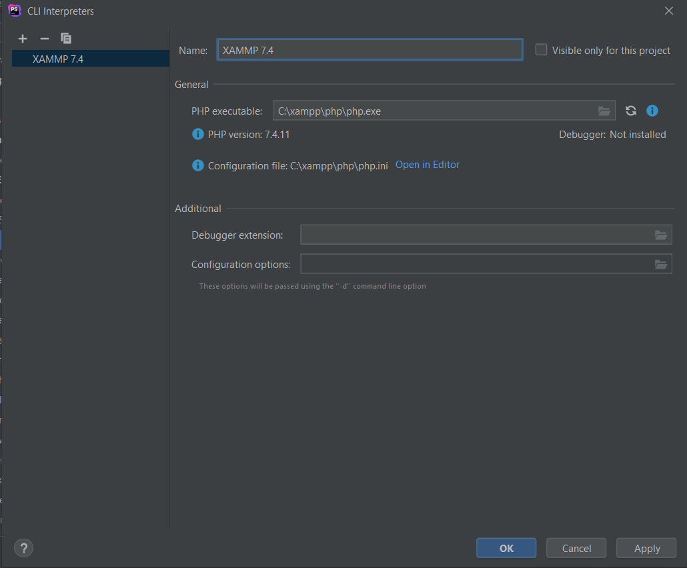
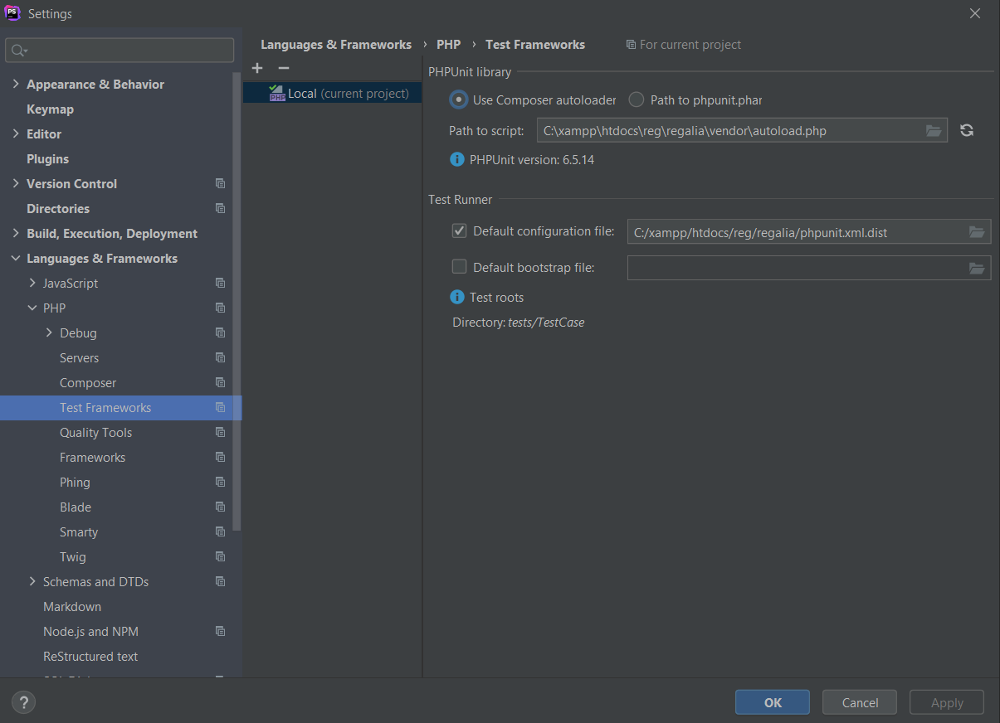
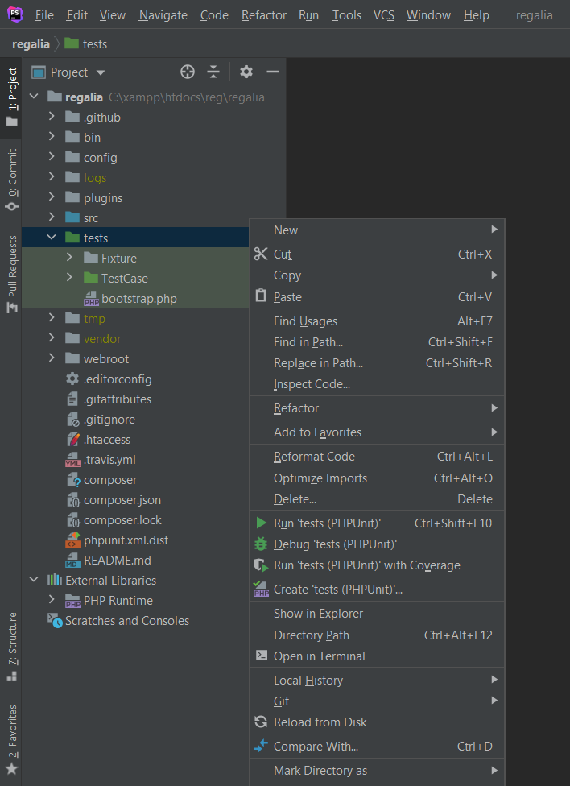

# Deployment
## Apache Server
* Install XAMPP(7.4.12) https://www.apachefriends.org/index.html
* Run the Apache and mysql by running xampp-control.exe (or corresponding executable if you are in MAC).
* 
## Create DB Tables
* Browse to http://localhost/phpMyAdmin/
    * Default username should be root without a password if asked.
* Create a database by using the new button on the top-left
    * 
    * Database name: regalia
    * Leave everything else the same and click create
* Click on the new regalia and select SQL tab
    * Copy and paste the contents of the files found in config/schema/regalia-complete.sql and click the go button in the bottom right.
* Go to the User Accounts tab and select edit privileges where the username is root
    * 
* Then select change password at the top. enter '1234' in both fields and hit go in the bottom right.

## Clone Repositories
* Browse to the C:/xampp/htdocs folder
* Clone the repo in that folder
    * https://github.com/etmitchell2022/regalia-loan-app-code.git
* Refactor app.default.php in the IDE of your choice and rename it to app.php
## Composer
* Download composer in whatever way applies to you in https://getcomposer.org/download/
* Browse to the folder containing the project in a command window and run
 ```console 
$ composer update
```
## Testing the Development Environment
* Within PHPStrom, press file and click on settings 
* On the left pane, click the tab that says languages and frameworks
* Click on PHP 
* On the right pane, the PHP langauge level doesn't matter, what you need to click on is the button with three dots
* On top of the left pane, click the plus button and select 'Local'
* This window should have appeared 
* You can name the interpreter however you like
* The PHP executable is located within the XAMPP folder system, browse to it and select it and the screen should now look like this 
* Click Apply and then click OK
* Back on the PHP page of the languages and frameworks you should be able to see that the Interpreter we just created should be there, click Apply if the button is not greyed out
* Now that the interpreter is set up, we have to set up PHPUnit which is autoloaded with Composer
* On the left pane, you should click on down arrow next to PHP if not already, and select Testing Frameworks
* Because PHPUnit is autoloaded, we must make PHPStorm recognize that
* On the rightmost pane, there are two selections up at the top, click the Path to phpunit.phar file, and then click back to the Use Composer Autoloader
* This should trigger the recognition of PHPUnit 
* Click Apply and OK
* Once back in the project folder, you are able to right click on the tests folder and an option to Run 'tests (PHPUnit)' is available 
* The tests should run


### Credit
* Format based off of https://github.com/hergin/BusShuttleMainRepository/blob/master/Manuals/NewDevelopmentManual.md by H. Ergin