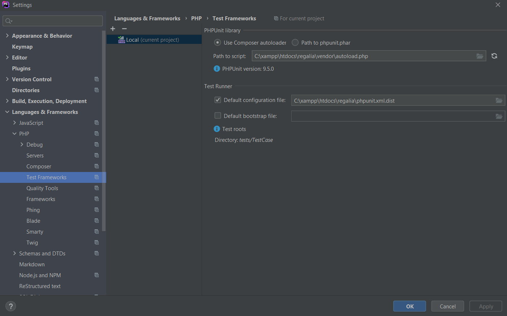

# Docker Development  
## Required Technologies
* PHPStorm : https://www.jetbrains.com/phpstorm/
* Docker : https://www.docker.com/products/docker-desktop


## Quick Explanation over File Structure
* docker/
  * initdb/
    * init.sql
      * This file is used to build our SQL database in our MySQL server with the nessecary tables and fields for our application.
  * regalia-web/
    * Dockerfile
      * This is our dockerfile, which is read by the docker-compose.yml file when our web container is started. This dockerfile runs the commands nessecary to configure our apache server.
  * docker-compose.yml
    * This is the file that is ran when the container is started. It has instructions on how we want each of our containers built and what volumes will be mounted.
* html/
  *  This is where all of our application files are stored, further explanation over application files further on in this document.

## Clone Repository
* Run ```git clone https://github.com/etmitchell2022/regalia-loan-app-code.git```
* Then cd into the project folder.

## Run Docker Containers
* cd into ./docker
* run `docker-compose up -d`
* The initial build may take some time.
* Once it is done, cd into the parent directory and then cd into ./html/
* Once in ./html/ run `composer install`

## Access Application
* You can access the application from `localhost:80`.
* Once you are here, you can login with `jodoe@bsu.edu` as the email and `1234` as the password.
* You can access phpMyAdmin from the address `localhost:8181`.

***

# Non-Docker Development  

## Required Technologies
* PHPStorm : https://www.jetbrains.com/phpstorm/
* XAMPP : https://www.apachefriends.org/index.html

## Apache Server
* Install XAMPP(7.4.12) https://www.apachefriends.org/index.html
* Run the Apache and mysql by running xampp-control.exe (or corresponding executable if you are in MAC).
* 
## Create DB Tables
* Browse to http://localhost/phpMyAdmin/
    * Default username should be root without a password if asked.
* Create a database by using the new button on the top-left
    * 
    * Database name: regalia
    * Leave everything else the same and click create
* Click on the new regalia and select SQL tab
    * Copy and paste the contents of the files found in config/schema/regalia-complete.sql and click the go button in the bottom right.
* Go to the User Accounts tab and select edit privileges where the username is root
    * 
* Then select change password at the top. enter '1234' in both fields and hit go in the bottom right.

## Clone Repositories
* Browse to the C:/xampp/htdocs folder
* Clone the repo in that folder
    * https://github.com/etmitchell2022/regalia-loan-app-code.git
* Refactor app.default.php in the IDE of your choice and rename it to app.php
## Composer
* Download composer in whatever way applies to you in https://getcomposer.org/download/
* Browse to the folder containing the project in a command window and run
 ```console 
$ composer update
```

## Quick Explanation over File Structure
* config/*
    * app_local.php
        * This is the main file that has a lot of important things within such as
            * The database connections
            * The Encryption key, known as Salt
            * The Mailer connections
            * How the Cache functions
    * requirements.php
        * This is the file that contains the messages that display when a requirement is not met
    * routes.php
        * This is the file that houses the routes within the application while it is runnign
* src/*
    * Controller/*
        * This folder is where all the controllers are located
    * Mailer/*
        * This is where the different Mailer triggers reside
    * Model/*
        * Entity/*
            * This is where each individual entity is
        * Table/*
            * This is where the local tables can be found
            * Queries are preformed through tables
    * Template/*
        * This is each and every page is located
        * Element/*
            * This is where abstracted and repeated page elements are
* tests/*
    * This is where all of the tests are located

***

# Testing the Development Environment with PHPUnit
## Setting up the Test Database
* Following the steps above for the 'Create DB Tables' under Development
    * Create a new Database called: test
    * Copy and paste the contents of the files found in config/schema/regalia-test.sql\
    * Follow the remained of the 'Create DB Tables'

## PHPUnit Check
* Within PHPStorm open the composer.json file

* Open the composer.json file, and search for "require-dev"
* Within the "require-dev" heading there should be "phpunit/phpunit"
* The number after the ':' of "phpunit" should be 6.5.14

* If the number is 6.5.14, then the correct version of PHPUnit is installed and the remainder of this portion can be ignored
* If the number is not 6.5.14
    * Replace the number with 6.5.14
    * Once done you must click the update button on the upper right of the page
    

## Configuring the Interpreter
* Within PHPStorm, press file and click on settings 

* On the left pane, click the tab that says languages and frameworks
* Click on PHP 
* On the right pane, the PHP language level doesn't matter, what you need to click on is the button with three dots
* On top of the left pane, click the plus button and select 'Local'
* This window should have appeared 
* You can name the interpreter however you like
* The PHP executable is located within the XAMPP folder system, browse to it and select it, and the screen should now look like this 
* Click Apply and then click OK

## Setting up PHPUnit
* Back on the PHP page of the languages and frameworks you should be able to see that the Interpreter we just created should be there, click Apply if the button is not greyed out
* Now that the interpreter is set up, we have to set up PHPUnit which is autoloaded with Composer
* On the left pane, you should click on down arrow next to PHP if not already, and select Testing Frameworks
* Because PHPUnit is autoloaded, we must make PHPStorm recognize that
* On the rightmost pane, there are two selections up at the top, click the Path to phpunit.phar file, and then click back to the Use Composer Autoloader
* This should trigger the recognition of PHPUnit 
* Click Apply and OK

## Running the Tests
* Once back in the project folder, you are able to right click on the tests folder, and an option to Run 'tests (PHPUnit)' is available 
* The tests should run

### Plugin: Codesniffer
* The following section is on how to work with the plugin: Codesniffer
    * This plugin will, in real time, produce warnings about code formatting based off of a pre-established format
* This project follows the format PSR-12, through the CakePHP codesniffer plugin

### Codesniffer Check
* Open the composer.json file, and navigate to the "require-dev"
* Within the "require-dev" field, there should be a field called "squizlabs/php_codesniffer"
* The number after the ':' of "squizlabs/php_codesniffer" should be 3.*

* If "squizlabs/php_codesniffer" : 3.* is present you can skip to the Configuring Codesniffer section

* If "squizlabs/php_codesniffer" : 3.* is not there you must type it in
    * Click the update button in the upper right
    

## Final Steps before Configuration
* Refer to the above section about setting up the PHP Interpreter within the testing section
* PHP must be added to the PATH variable
    * In Windows: https://www.architectryan.com/2018/03/17/add-to-the-path-on-windows-10/
    * In MAC: https://www.cyberciti.biz/faq/appleosx-bash-unix-change-set-path-environment-variable/
    * In Linux: https://www.baeldung.com/linux/path-variable

## Configuring Codesniffer
* Click File and open the Settings menu

* Click the Languages & Frameworks section
* Click the PHP dropdown arrow
* Click the Quality Tools option
* Within the right pane, click on the PHP_Codesniffer option
* Click the 3 dots next to local

* You will need to file in both location fields to lead to each item, they are located under Vender, and should match the image below

* To make sure they work click the Verify button
* Click Apply and OK

## Making Codesniffer Work
* We have only made PHPStorm recognize the Codesniffer is a thing, we must finish the setup process to make it recognize the formatting issues
* Within the Settings menu, click the Editor dropdown
* Click Inspectors
* On the middle pane, click the PHP dropdown, and then click Quality Tools dropdown
* Click Codesniffer
* On the leftmost pane should be a coding standard selector, click it and select PSR-12


## Credit
* Format based off of https://github.com/hergin/BusShuttleMainRepository/blob/master/Manuals/NewDevelopmentManual.md by H. Ergin
