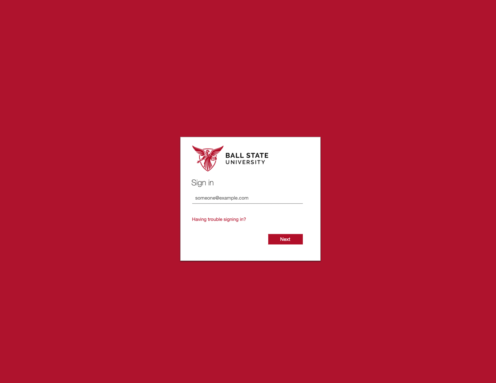
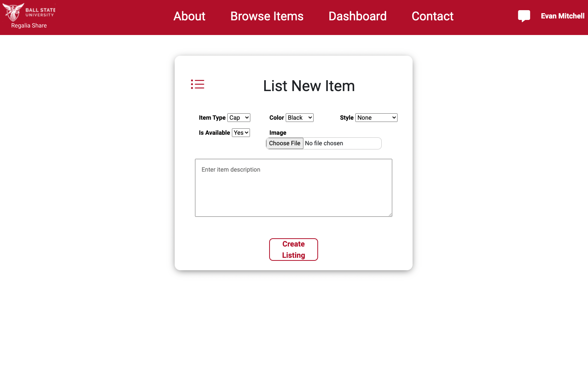
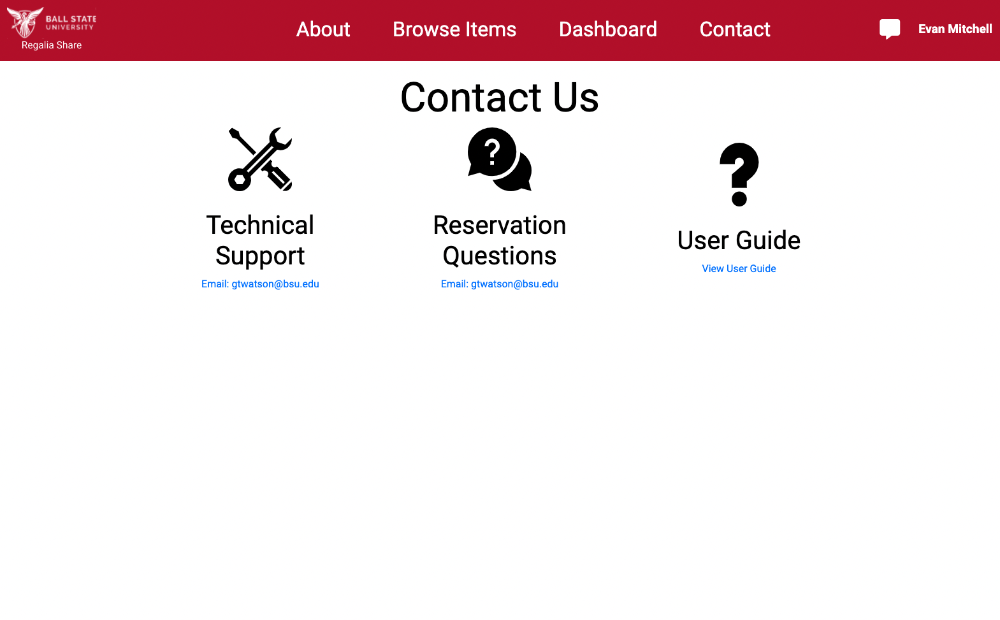

# Sign In
The first page seen when loading into the site is the Ball State SSO where the user will need to enter their credentials before entering the site. After successfully logging in, you will be redirected to the dashboard.
# Reserve an Item
Select the View Items tab in the nav bar to see all available items. You can select between capes robes and hoods here. You can filter between different types of products as well as the dates available. Once you find an item you wish to reserve, click the view item button. In this view you can get a better look at the item and its details. You will be able to see te item details, along with the days this item is already being reserved.
# List an Item
Listing a new item can be done from the dashboard and on the My Listings page.  Then click the List a new Item button. Here you can enter any information needed as well as upload a picture if desired.
# Contact an Admin
Select the Contact tab in the nav bar to view your options. There will be an email for any techical questions or issues, an email for questions about reservations or any regalia related question, and the last option will link the user to a page explaining how to use the site. 
# Check Reservations
Select the Dashboard tab in the nav bar and select the My Reservations option. From here you will see the status of your reservations. You can click on an of them to see more details on the item and reservation.
# Replying to a Message
Select the Dashboard Tab in the nav bar and then select view all messages. From there you can select the message you wish to reply to by clicking the reply option. You can also filter the messages by unread and read to easily find your new messages.  You will then be taken to the view message page where you can read and respond the message.

