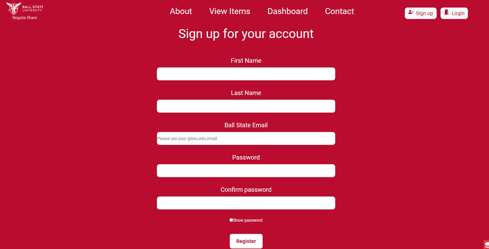
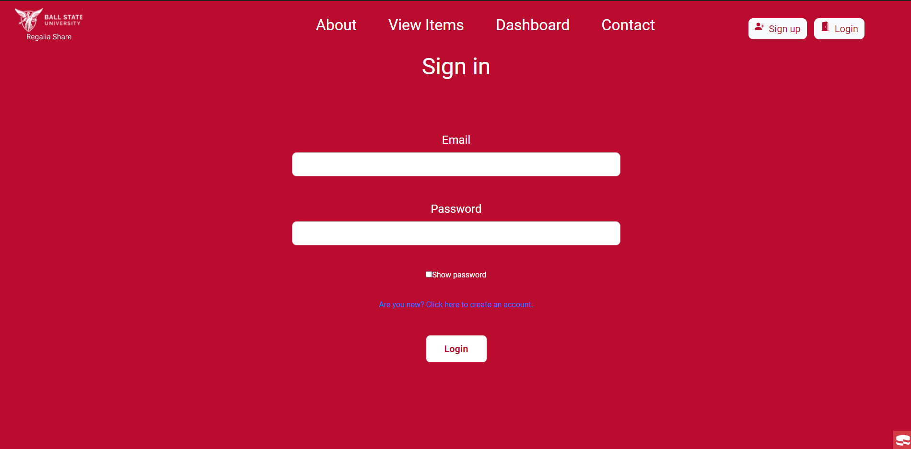
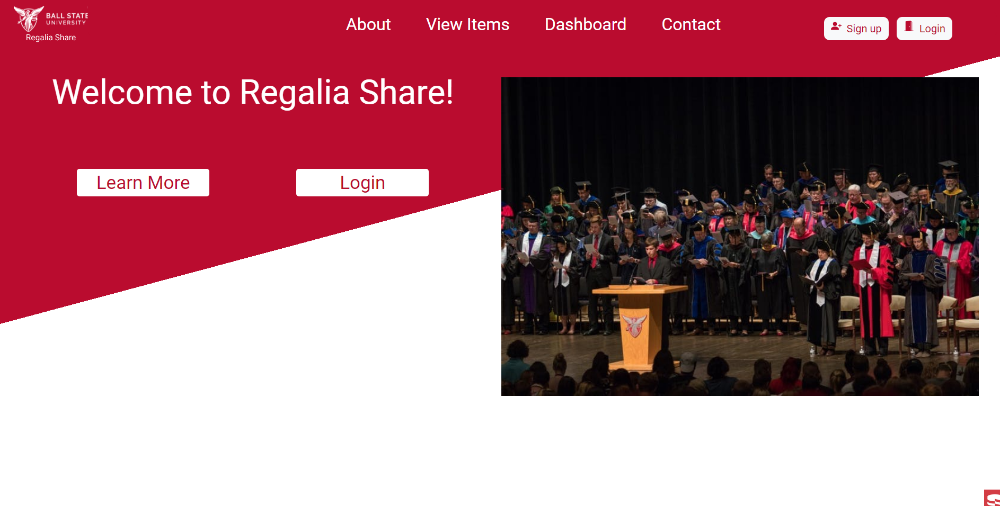
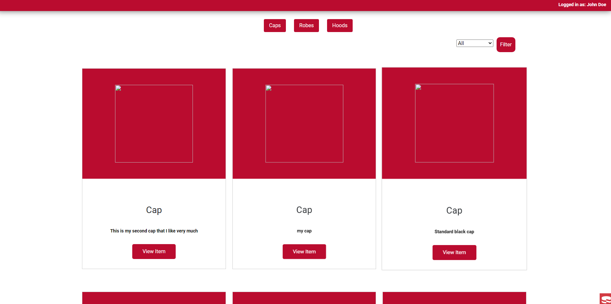
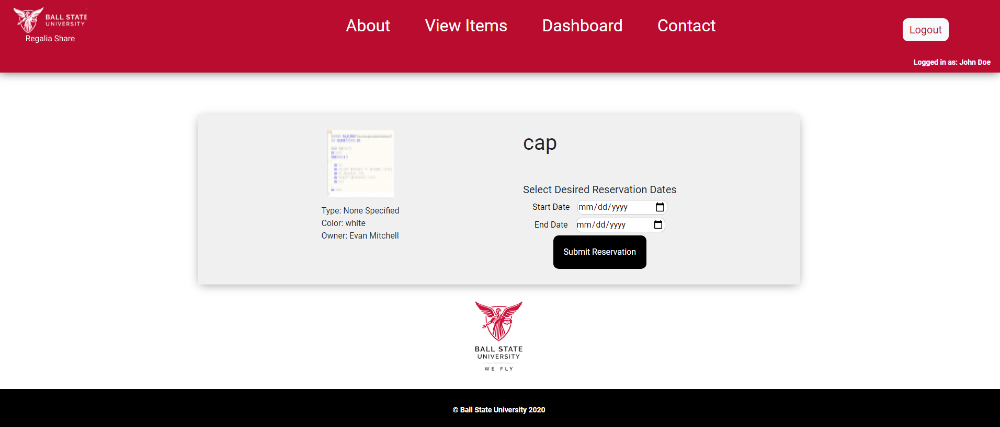
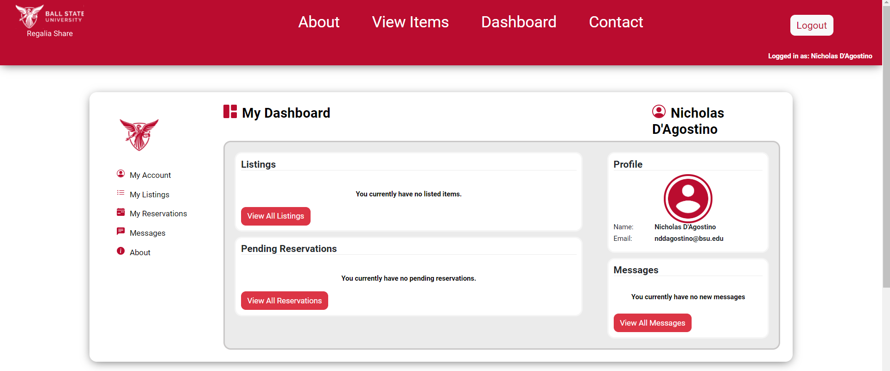
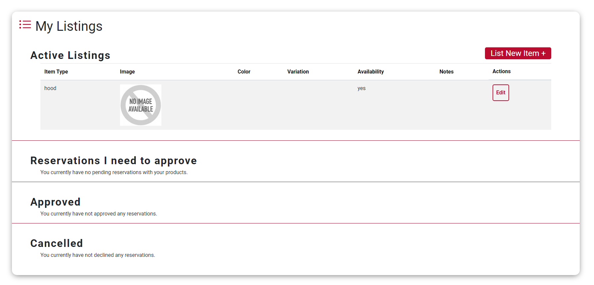
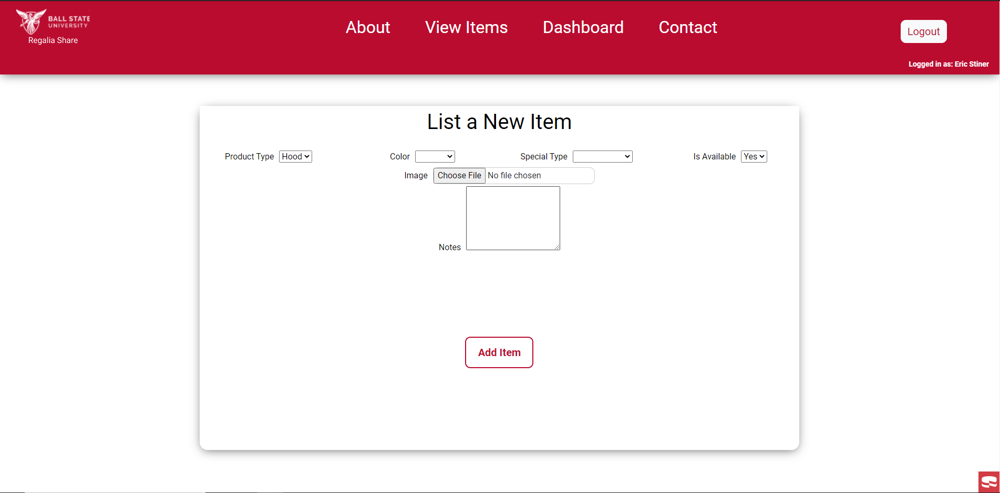
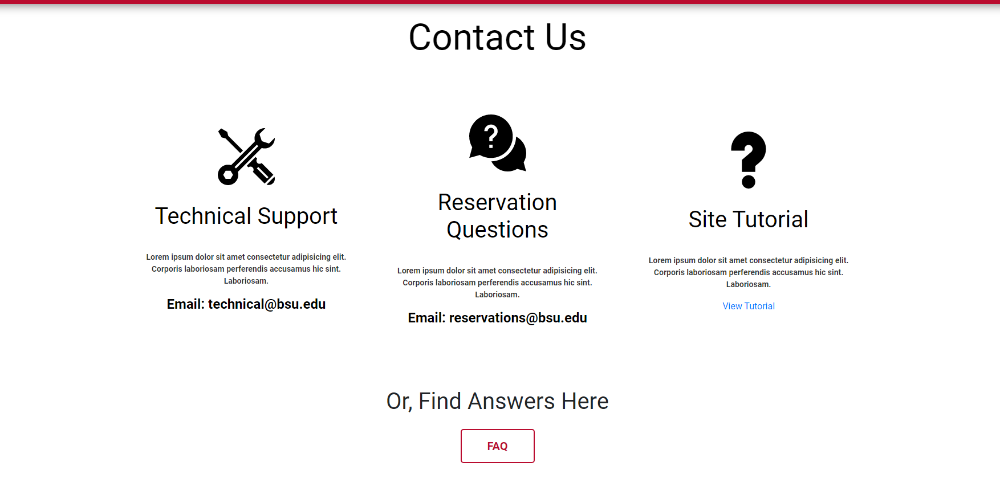
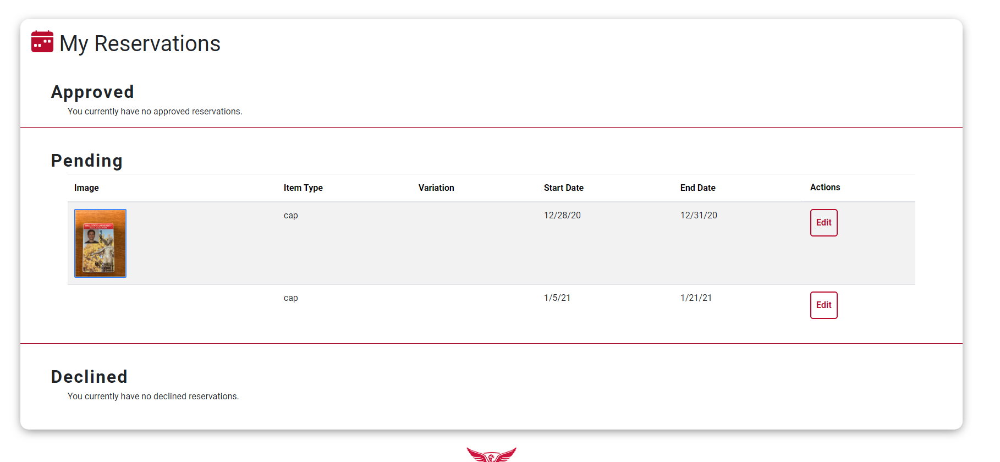

# Sign up
In the top right corner of every page will be a "Sign up" button. select the button, and you should be taken to a form that requires information such as name, email, phone number and password.  The email must be a bsu.edu email. Be sure to choose a strong password, unique to this site.
# Sign In
The landing page of the website will be a Sign In page where you can enter the email and password created in the sign up page.  If you navigate away from the landing page, simply click the ball state logo in the upper left corner, and a sign in button will be in the middle of the page.
# Reserve an Item
Select the View Items tab in the nav bar to see all available items. You can select between capes robes and hoods here. You can filter between different types of products Once you find an item you wish to reserve, click the view item button. In this view you can get a better look at the item and its details. If you decide this is the item you want to reserve click the reserve item button.
# List an Item
Select the Dashboard tab in the nav bar and from there select My Listings option.  Then click the List a new Item button. Here you can enter any information needed as well as upload a picture if desired.
# Contact an Admin
Select the Contact tab in the nav bar to see a form that can be filled out and sent to an admin. 
# Check Reservations
Select the Dashboard tab in the nav bar and from there select My Reservations option. From here you will see the status of your reservations. You can click on an of them to see more details on the item and reservation.
 
